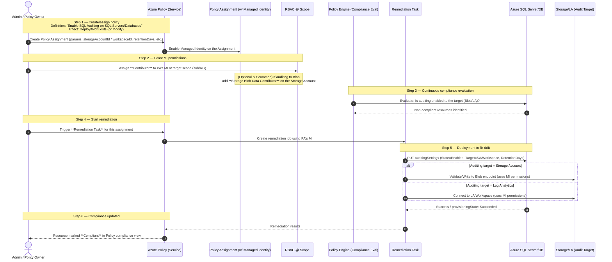

Here’s a clean and professional example showing **Azure Subscription**, **Resource/Resource Group**, **Role Assignments**, and **Identity Types (Managed Identity, Service Principal, or Static Group)** — formatted in a clear bulleted layout:

---

### 🌐 **Azure Role Assignment Example**

* **Subscription Name:**
  `Production-Enterprise-Apps-Sub01`

* **Resource Group:**
  `rg-data-ingestion-prod`

* **Resource:**
  `azfunc-data-ingest-funcapp`

* **Role Assignments:**

  * **Contributor** → `mi-funcapp-dataingest` *(Managed Identity)*
  * **Storage Blob Data Contributor** → `spn-adls-ingest-writer` *(Service Principal)*
  * **Reader** → `grp-dataops-observers` *(Static AD Group)*
  * **Key Vault Secrets User** → `mi-funcapp-dataingest` *(Managed Identity)*
  * **SQL DB Contributor** → `spn-sqlaccess-datawriter` *(Service Principal)*

---

### 🧩 **Additional Example**

* **Subscription Name:**
  `Dev-Test-Analytics-Sub02`

* **Resource Group:**
  `rg-analytics-dev`

* **Resources:**

  * `synapse-workspace-dev`
  * `datalake-analytics-dev`
  * `keyvault-analytics-dev`

* **Role Assignments:**

  * **Synapse Administrator** → `grp-analytics-admins` *(Static Group)*
  * **Storage Blob Data Reader** → `mi-logicapp-analytics` *(Managed Identity)*
  * **Key Vault Secrets Officer** → `spn-automation-ci-cd` *(Service Principal)*

---

Would you like me to present this as a **table format (Markdown or CSV)** for easier import into Excel or Azure documentation?


# Azure-Policy-Automatic-remediation


Here’s a complete **Azure Policy** definition that ensures **Application Gateway** resources have **diagnostic settings** configured to send both **ApplicationGatewayAccessLog** and **ApplicationGatewayFirewallLog** categories to a specified **Log Analytics workspace**.

---

### ✅ **Policy Definition – Enable Diagnostic Logs for Application Gateway**

```json
{
  "properties": {
    "displayName": "Configure Application Gateway to send logs to Log Analytics workspace",
    "policyType": "Custom",
    "mode": "Indexed",
    "description": "This policy ensures Application Gateways send Application Gateway Access Logs and Application Gateway Firewall Logs to a designated Log Analytics workspace.",
    "metadata": {
      "category": "Network",
      "version": "1.0.0"
    },
    "parameters": {
      "logAnalytics": {
        "type": "String",
        "metadata": {
          "displayName": "Log Analytics Workspace Resource ID",
          "description": "The resource ID of the Log Analytics workspace to which logs should be sent."
        }
      }
    },
    "policyRule": {
      "if": {
        "allOf": [
          {
            "field": "type",
            "equals": "Microsoft.Network/applicationGateways"
          },
          {
            "count": {
              "field": "Microsoft.Insights/diagnosticSettings",
              "where": {
                "allOf": [
                  {
                    "field": "Microsoft.Insights/diagnosticSettings/logs[*].category",
                    "in": [
                      "ApplicationGatewayAccessLog",
                      "ApplicationGatewayFirewallLog"
                    ]
                  },
                  {
                    "field": "Microsoft.Insights/diagnosticSettings/workspaceId",
                    "equals": "[parameters('logAnalytics')]"
                  }
                ]
              }
            },
            "equals": 0
          }
        ]
      },
      "then": {
        "effect": "DeployIfNotExists",
        "details": {
          "type": "Microsoft.Insights/diagnosticSettings",
          "roleDefinitionIds": [
            "/providers/microsoft.authorization/roleDefinitions/ed4319e3-7b33-4e71-9c1a-b3ef51cabe04"  // Monitoring Contributor
          ],
          "deployment": {
            "properties": {
              "mode": "incremental",
              "template": {
                "$schema": "https://schema.management.azure.com/schemas/2019-04-01/deploymentTemplate.json#",
                "contentVersion": "1.0.0.0",
                "resources": [
                  {
                    "type": "Microsoft.Insights/diagnosticSettings",
                    "apiVersion": "2021-05-01-preview",
                    "name": "set-by-policy",
                    "properties": {
                      "workspaceId": "[parameters('logAnalytics')]",
                      "logs": [
                        {
                          "category": "ApplicationGatewayAccessLog",
                          "enabled": true
                        },
                        {
                          "category": "ApplicationGatewayPerformanceLog",
                          "enabled": true
                        },
                        {
                          "category": "ApplicationGatewayFirewallLog",
                          "enabled": true
                        }
                      ]
                    }
                  }
                ]
              }
            }
          }
        }
      }
    }
  }
}
```

---

### 🧩 **How It Works**

| Section                      | Description                                                                                                        |
| ---------------------------- | ------------------------------------------------------------------------------------------------------------------ |
| **If Condition**             | Checks if an Application Gateway exists without diagnostic settings sending logs to the specified workspace.       |
| **Then (DeployIfNotExists)** | Automatically deploys diagnostic settings to send logs to Log Analytics.                                           |
| **Log Categories**           | `ApplicationGatewayAccessLog`, `ApplicationGatewayPerformanceLog`, `ApplicationGatewayFirewallLog`.                |
| **Effect**                   | Enforces via `DeployIfNotExists` — auto-remediates non-compliant resources.                                        |
| **Role Requirement**         | The managed identity assigned for remediation needs **Monitoring Contributor** on the target Application Gateways. |

---

### ⚙️ **Parameter Example (Assignment Scope)**

```json
{
  "parameters": {
    "logAnalytics": {
      "value": "/subscriptions/<subscription-id>/resourceGroups/<rg-name>/providers/Microsoft.OperationalInsights/workspaces/<workspace-name>"
    }
  }
}
```

---

### 🧠 **Best Practice Tips**

* Assign this policy at **subscription** or **management group** scope.
* Ensure your **policy assignment** includes a **managed identity** with `Monitoring Contributor` rights.
* Include this in your **Azure Policy Initiative** for “Network Monitoring Standards”.

---

Would you like me to add a **remediation task diagram (Mermaid)** showing the sequence (Policy → MI → ARM → DiagnosticSettings)?


Here’s a clear Mermaid **sequence diagram** showing how an Azure Policy remediation runs with a Managed Identity (MI) that has **Contributor** access to enable **Azure SQL auditing**:



**Notes**

* The **Managed Identity on the policy assignment** is what performs the fix. Giving it **Contributor** at the remediation scope is sufficient for most deploy actions.
* If auditing targets a **Storage Account (Blob)**, also grant that MI **Storage Blob Data Contributor** on the Storage Account (data-plane write).
* Use the built-in definitions like *“Configure SQL servers to have auditing enabled”* and *“Configure Azure SQL databases to have auditing enabled”* with **DeployIfNotExists**.
* Typical parameters: `storageAccountId` **or** `logAnalyticsDestinationType/workspaceId`, plus `retentionDays`.


Here’s a ready-to-use **Azure Policy definition** that will enforce *Azure SQL Auditing* is enabled on your SQL servers.

### Policy Definition – Enable Azure SQL Auditing

```json
{
  "properties": {
    "displayName": "Enable Azure SQL Auditing",
    "policyType": "BuiltIn",
    "mode": "All",
    "description": "This policy ensures that Azure SQL servers have auditing enabled to capture database events for compliance and security purposes.",
    "metadata": {
      "category": "SQL"
    },
    "parameters": {
      "retentionDays": {
        "type": "Integer",
        "metadata": {
          "displayName": "Retention days",
          "description": "Number of days to retain audit logs."
        },
        "defaultValue": 90
      }
    },
    "policyRule": {
      "if": {
        "allOf": [
          {
            "field": "type",
            "equals": "Microsoft.Sql/servers"
          }
        ]
      },
      "then": {
        "effect": "DeployIfNotExists",
        "details": {
          "type": "Microsoft.Sql/servers/auditingSettings",
          "name": "default",
          "existenceCondition": {
            "field": "Microsoft.Sql/servers/auditingSettings.state",
            "equals": "Enabled"
          },
          "roleDefinitionIds": [
            "/providers/microsoft.authorization/roleDefinitions/fd902c8b-1a23-4c0f-9e64-b5b2f1b1f4d5" 
          ],
          "deployment": {
            "properties": {
              "mode": "incremental",
              "template": {
                "$schema": "https://schema.management.azure.com/schemas/2019-04-01/deploymentTemplate.json#",
                "contentVersion": "1.0.0.0",
                "resources": [
                  {
                    "type": "Microsoft.Sql/servers/auditingSettings",
                    "apiVersion": "2022-05-01-preview",
                    "name": "[concat(parameters('serverName'), '/default')]",
                    "properties": {
                      "state": "Enabled",
                      "isAzureMonitorTargetEnabled": true,
                      "retentionDays": "[parameters('retentionDays')]"
                    }
                  }
                ]
              }
            }
          }
        }
      }
    }
  }
}
```

---

### How It Works

* **Condition (`if`)**: Applies to all resources of type `Microsoft.Sql/servers`.
* **Effect (`then`)**:

  * Uses **DeployIfNotExists** to check if auditing is enabled.
  * If not, it will deploy an `auditingSettings` resource with **state = Enabled**.
* **RetentionDays parameter**: Defaults to 90, but you can override.
* **Role Definition**: Requires **SQL Security Manager** role (ID: `fd902c8b-1a23-4c0f-9e64-b5b2f1b1f4d5`) for remediation.

---

✅ With this policy assigned, any SQL server without auditing will automatically have auditing enabled (with logs flowing to Azure Monitor or your configured destination).

Would you like me to also include a **companion initiative** that bundles this with other SQL security policies (like threat detection, TDE, and firewall rules) so you can assign them as one package?


Here’s a sample **Azure Policy definition** that enforces **Application Gateway to use TLS 1.2 or higher (TLS 1.2, TLS 1.3)** using `DeployIfNotExists`.

This ensures that if an Application Gateway is not configured with at least **TLS 1.2**, the policy will remediate it by updating the SSL policy.

```json
{
  "properties": {
    "displayName": "Enforce TLS 1.2 or higher for Application Gateway",
    "policyType": "Custom",
    "mode": "Indexed",
    "description": "This policy ensures Application Gateways are configured to use TLS 1.2 or higher (TLS 1.2, TLS 1.3).",
    "metadata": {
      "version": "1.0.0",
      "category": "Application Gateway"
    },
    "parameters": {
      "effect": {
        "type": "String",
        "defaultValue": "DeployIfNotExists",
        "allowedValues": [
          "DeployIfNotExists",
          "AuditIfNotExists",
          "Disabled"
        ],
        "metadata": {
          "description": "The effect of the policy",
          "displayName": "Effect"
        }
      }
    },
    "policyRule": {
      "if": {
        "allOf": [
          {
            "field": "type",
            "equals": "Microsoft.Network/applicationGateways"
          },
          {
            "anyOf": [
              {
                "field": "Microsoft.Network/applicationGateways/sslPolicy.minProtocolVersion",
                "notEquals": "TLSv1_2"
              },
              {
                "field": "Microsoft.Network/applicationGateways/sslPolicy.minProtocolVersion",
                "notEquals": "TLSv1_3"
              }
            ]
          }
        ]
      },
      "then": {
        "effect": "[parameters('effect')]",
        "details": {
          "type": "Microsoft.Network/applicationGateways",
          "roleDefinitionIds": [
            "/providers/microsoft.authorization/roleDefinitions/fd72cdd0-5f48-46d9-8a4b-33f7cf9df939"  // Contributor role
          ],
          "deployment": {
            "properties": {
              "mode": "incremental",
              "template": {
                "$schema": "https://schema.management.azure.com/schemas/2019-04-01/deploymentTemplate.json#",
                "contentVersion": "1.0.0.0",
                "resources": [
                  {
                    "type": "Microsoft.Network/applicationGateways",
                    "apiVersion": "2022-09-01",
                    "name": "[field('name')]",
                    "location": "[field('location')]",
                    "properties": {
                      "sslPolicy": {
                        "policyType": "Predefined",
                        "policyName": "AppGwSslPolicy20220101"  // supports TLS 1.2+
                      }
                    }
                  }
                ]
              }
            }
          }
        }
      }
    }
  }
}
```

### 🔑 Key Points:

* **Condition (`if`)** checks if Application Gateway has `sslPolicy.minProtocolVersion` less than TLS 1.2.
* **DeployIfNotExists** will update the Application Gateway to use **`AppGwSslPolicy20220101`**, which enforces **TLS 1.2 or higher**.
* You can change to **`Custom`** if you want to explicitly set **TLS 1.3** when available.
* The `roleDefinitionIds` allows remediation (Contributor role).

---

👉 Do you want me to also provide a **matching Initiative** (so you can assign this policy easily across multiple subscriptions/management groups), or just the single policy definition is enough?

Here is a full **Logic App Designer JSON** that:

✅ Queries Log Analytics
✅ Transforms result rows into an **object array**
✅ Converts that object array into **CSV format**
✅ Emails the CSV as an **attachment**

---

## 🧩 **Logic App Designer JSON – Object Array to CSV Attachment in Email**

```json
{
  "definition": {
    "$schema": "https://schema.management.azure.com/providers/Microsoft.Logic/schemas/2019-05-01/workflowDefinition.json#",
    "actions": {
      "Run_Query_and_List_Results": {
        "type": "ApiConnection",
        "inputs": {
          "host": {
            "connection": {
              "name": "@parameters('$connections')['azuremonitorlogs']['connectionId']"
            }
          },
          "method": "get",
          "path": "/v1/workspaces/<your-workspace-id>/query",
          "queries": {
            "query": "Heartbeat | where TimeGenerated > ago(1d) | project TimeGenerated, Computer, OSType"
          }
        },
        "runAfter": {}
      },
      "Select_Object_Array": {
        "type": "Select",
        "inputs": {
          "from": "@body('Run_Query_and_List_Results')?['tables']?[0]?['rows']",
          "select": {
            "TimeGenerated": "@item()[0]",
            "Computer": "@item()[1]",
            "OSType": "@item()[2]"
          }
        },
        "runAfter": {
          "Run_Query_and_List_Results": ["Succeeded"]
        }
      },
      "Initialize_CSV": {
        "type": "InitializeVariable",
        "inputs": {
          "variables": [
            {
              "name": "csvContent",
              "type": "String",
              "value": "TimeGenerated,Computer,OSType\n"
            }
          ]
        },
        "runAfter": {
          "Select_Object_Array": ["Succeeded"]
        }
      },
      "For_Each_Record": {
        "type": "Foreach",
        "foreach": "@outputs('Select_Object_Array')",
        "actions": {
          "Append_CSV_Line": {
            "type": "AppendToStringVariable",
            "inputs": {
              "name": "csvContent",
              "value": "@{items('For_Each_Record')?['TimeGenerated']},@{items('For_Each_Record')?['Computer']},@{items('For_Each_Record')?['OSType']}\n"
            }
          }
        },
        "runAfter": {
          "Initialize_CSV": ["Succeeded"]
        }
      },
      "Send_Email_With_CSV_Attachment": {
        "type": "ApiConnection",
        "inputs": {
          "host": {
            "connection": {
              "name": "@parameters('$connections')['office365']['connectionId']"
            }
          },
          "method": "post",
          "path": "/v2/Mail",
          "body": {
            "To": ["you@example.com"],
            "Subject": "Log Analytics CSV Export",
            "Body": "Please find attached the latest log analytics results in CSV format.",
            "Attachments": [
              {
                "Name": "log-report.csv",
                "ContentBytes": "@base64(variables('csvContent'))"
              }
            ]
          }
        },
        "runAfter": {
          "For_Each_Record": ["Succeeded"]
        }
      }
    },
    "triggers": {
      "manual": {
        "type": "Request",
        "kind": "Http",
        "inputs": {
          "schema": {}
        }
      }
    },
    "outputs": {}
  },
  "parameters": {
    "$connections": {
      "value": {
        "azuremonitorlogs": {
          "connectionId": "/subscriptions/<your-subscription-id>/resourceGroups/<your-resource-group>/providers/Microsoft.Web/connections/azuremonitorlogs",
          "connectionName": "azuremonitorlogs",
          "id": "/subscriptions/<your-subscription-id>/providers/Microsoft.Web/locations/<your-region>/managedApis/azuremonitorlogs"
        },
        "office365": {
          "connectionId": "/subscriptions/<your-subscription-id>/resourceGroups/<your-resource-group>/providers/Microsoft.Web/connections/office365",
          "connectionName": "office365",
          "id": "/subscriptions/<your-subscription-id>/providers/Microsoft.Web/locations/<your-region>/managedApis/office365"
        }
      }
    }
  }
}
```

---

## 🔁 Replace the Following

| Placeholder              | Replace With                        |
| ------------------------ | ----------------------------------- |
| `<your-workspace-id>`    | Log Analytics Workspace ID          |
| `<your-subscription-id>` | Your Azure Subscription ID          |
| `<your-resource-group>`  | The Resource Group of the Logic App |
| `<your-region>`          | Azure Region (e.g. `eastus`)        |
| `you@example.com`        | Your destination email address      |

---

## 🧠 Logic App Flow Summary

1. **Trigger**: Manual (can switch to Recurrence)
2. **Query**: `Heartbeat` table from Log Analytics (customizable)
3. **Transform**: Raw rows → Object Array using `Select`
4. **Format CSV**:

   * Initialize CSV string
   * Loop through array and append lines
5. **Send Email**: Attach CSV (converted to base64) and send it

---

Would you like me to export this into a downloadable `.json` file for upload, or extend it to **write to Azure Blob Storage** before emailing?


Here's a complete **Logic App Designer JSON** definition that:

✅ Queries **Log Analytics Workspace**
✅ Converts the result into an **object array**
✅ Outputs that array using a `Select` action (so it can be used as CSV, HTML table, JSON, etc.)

---

## ✅ Use Case

* Run a Kusto Query (e.g., on `Heartbeat`)
* Convert raw results (`rows`) into structured **object array**
* Use this object array in downstream actions (email, CSV, blob, etc.)

---

## 🧩 Logic App Designer JSON

```json
{
  "definition": {
    "$schema": "https://schema.management.azure.com/providers/Microsoft.Logic/schemas/2019-05-01/workflowDefinition.json#",
    "actions": {
      "Run_Query_and_List_Results": {
        "type": "ApiConnection",
        "inputs": {
          "host": {
            "connection": {
              "name": "@parameters('$connections')['azuremonitorlogs']['connectionId']"
            }
          },
          "method": "get",
          "path": "/v1/workspaces/<your-workspace-id>/query",
          "queries": {
            "query": "Heartbeat | where TimeGenerated > ago(1d) | project TimeGenerated, Computer, OSType"
          }
        },
        "runAfter": {}
      },
      "Select_Object_Array": {
        "type": "Select",
        "inputs": {
          "from": "@body('Run_Query_and_List_Results')?['tables']?[0]?['rows']",
          "select": {
            "TimeGenerated": "@item()[0]",
            "Computer": "@item()[1]",
            "OSType": "@item()[2]"
          }
        },
        "runAfter": {
          "Run_Query_and_List_Results": ["Succeeded"]
        }
      },
      "Compose_Output_Object_Array": {
        "type": "Compose",
        "inputs": "@outputs('Select_Object_Array')",
        "runAfter": {
          "Select_Object_Array": ["Succeeded"]
        }
      }
    },
    "triggers": {
      "manual": {
        "type": "Request",
        "kind": "Http",
        "inputs": {
          "schema": {}
        }
      }
    },
    "outputs": {}
  },
  "parameters": {
    "$connections": {
      "value": {
        "azuremonitorlogs": {
          "connectionId": "/subscriptions/<subscription-id>/resourceGroups/<resource-group>/providers/Microsoft.Web/connections/azuremonitorlogs",
          "connectionName": "azuremonitorlogs",
          "id": "/subscriptions/<subscription-id>/providers/Microsoft.Web/locations/<region>/managedApis/azuremonitorlogs"
        }
      }
    }
  }
}
```

---

## 🔁 Replace Placeholders

| Placeholder           | Replace With                    |
| --------------------- | ------------------------------- |
| `<your-workspace-id>` | Your Log Analytics Workspace ID |
| `<subscription-id>`   | Your Azure subscription         |
| `<resource-group>`    | Resource group of the Logic App |
| `<region>`            | Azure region (e.g., `eastus`)   |

---

## 🔄 What This Logic App Does

1. **Trigger**: Manual (HTTP)
2. **Action 1**: Run KQL query on Log Analytics
3. **Action 2**: `Select` rows and convert array to structured JSON
4. **Action 3**: Output object array in a Compose block

---

### ✅ Output Sample from Compose Step

```json
[
  {
    "TimeGenerated": "2024-08-01T00:00:00Z",
    "Computer": "server01",
    "OSType": "Windows"
  },
  {
    "TimeGenerated": "2024-08-01T01:00:00Z",
    "Computer": "server02",
    "OSType": "Linux"
  }
]
```

---

## 📦 Next Step Options

You can now:

* Append this to a CSV in Blob
* Send via Email
* Store in Azure SQL or Table Storage

Would you like a full version that exports this object array to **CSV and emails it** as an attachment automatically?

## 1. **Use a `Response` action (for HTTP-triggered apps)**

If your Logic App starts with an **HTTP trigger**, you can add a **Response** action at the end to return values (JSON, text, etc.) back to the caller (Postman, cURL, API, another app).

Example:

```json

{
  "properties": {
    "policyAssignmentId": "/subscriptions/35ee058e-5fa0-414c-8145-3ebb8d09b6e2/providers/microsoft.authorization/policyassignments/b101830944f246d8a14088c5",
    "provisioningState": "Succeeded",
    "createdOn": "2018-09-13T21:51:09.075918Z",
    "lastUpdatedOn": "2018-09-13T21:52:10.0011706Z",
    "resourceDiscoveryMode": "ExistingNonCompliant",
    "deploymentStatus": {
      "totalDeployments": 2,
      "successfulDeployments": 2,
      "failedDeployments": 0
    },
    "statusMessage": "Remediation extended status",
    "correlationId": "a14e1d60-dae9-4771-b4be-a556d69e77a6",
    "resourceCount": 42,
    "parallelDeployments": 6,
    "failureThreshold": {
      "percentage": 0.1
    }
  },
  "id": "/subscriptions/35ee058e-5fa0-414c-8145-3ebb8d09b6e2/providers/microsoft.policyinsights/remediations/storageRemediation",
  "name": "storageRemediation",
  "type": "Microsoft.PolicyInsights/remediations",
  "systemData": {
    "createdBy": "b69a9388-9488-4534-b470-7ec6d41beef6",
    "createdByType": "User",
    "createdAt": "2018-09-13T21:51:09.075918Z",
    "lastModifiedBy": "b69a9388-9488-4534-b470-7ec6d41beef6",
    "lastModifiedByType": "User",
    "lastModifiedAt": "2018-09-13T21:52:10.0011706Z"
  }
}
{
  "type": "Response",
  "inputs": {
    "statusCode": 200,
    "headers": { "Content-Type": "application/json" },
    "body": {
      "message": "Remediation workflow complete",
      "nonCompliantCount": "@outputs('Compose_NonCompliant_Count')",
      "remediationResult": "@actions('Create_Remediation_Subscription')?['outputs']"
    }
  }
}
```

👉 This way, when you call the Logic App URL, you’ll see the JSON response with your remediation results.

---

## 2. **Use `Compose` actions**

* `Compose` is handy for showing intermediate results (counts, JSON, or text).
* These show up in the **Run History** in the portal.
* You already have `Compose_NonCompliant_Count` and `Compose_Skip_Message` in the workflow I shared — those values will be visible in the run logs.

---

## 3. **Send outputs elsewhere**

You can add actions like:

* **Send an email** (Office 365 Outlook, SMTP, etc.)
* **Post a message to Teams / Slack**
* **Insert a row in a SQL table**
* **Write to Blob Storage / Log Analytics**

Example (send an email with results):

```json
{
  "type": "ApiConnection",
  "inputs": {
    "host": {
      "connection": { "name": "@parameters('$connections')['office365']['connectionId']" }
    },
    "method": "post",
    "path": "/v2/Mail",
    "body": {
      "To": "ops-team@contoso.com",
      "Subject": "Azure Policy Remediation Results",
      "Body": "Non-compliant count: @{outputs('Compose_NonCompliant_Count')}"
    }
  }
}
```

---

## 4. **Check Run History**

Even without a Response action:

* Go to your Logic App in the Azure Portal.
* Open **Runs history** → select a run → expand actions → see inputs/outputs.
* This is often how you debug and inspect outputs like compliance counts or remediation API responses.

---

✅ **Best practice**:
If you expect to trigger the Logic App manually or from another app → use a **Response** action.
If you just want to monitor → rely on **Compose** and the **Run History**, or push results to monitoring (Log Analytics, Storage, etc.).

---

Would you like me to **add a `Response` action** to the workflow I gave you so it automatically returns the remediation outcome to Postman/cURL when you test it?


Here’s a **Logic App (Consumption) Code View** workflow that:

1. Accepts a POST with your `policyAssignmentId` and `remediationName`
2. Calls **Policy Insights – policyStates/latest/summarize** to get the non-compliant count
3. **If count > 0**, creates a remediation (subscription scope by default, easy toggle for RG)

---

### Logic App — Code View JSON

```json
{
  "definition": {
    "$schema": "https://schema.management.azure.com/schemas/2016-06-01/workflows.json",
    "contentVersion": "1.0.0.0",
    "parameters": {
      "subscriptionId": {
        "type": "string",
        "defaultValue": "<SUBSCRIPTION-ID>"
      },
      "defaultScope": {
        "type": "string",
        "defaultValue": "subscription",
        "metadata": { "description": "Use 'subscription' or 'resourceGroup'." }
      },
      "policyApiVersion": {
        "type": "string",
        "defaultValue": "2022-09-01"
      },
      "remediationApiVersion": {
        "type": "string",
        "defaultValue": "2021-10-01"
      }
    },
    "triggers": {
      "http_in": {
        "type": "Request",
        "kind": "Http",
        "inputs": {
          "method": "POST",
          "schema": {
            "type": "object",
            "required": [ "remediationName", "policyAssignmentId" ],
            "properties": {
              "remediationName": { "type": "string" },
              "policyAssignmentId": { "type": "string" },
              "resourceGroupName": { "type": "string", "description": "Required when defaultScope = resourceGroup" },
              "policyDefinitionReferenceId": { "type": "string" },
              "resourceDiscoveryMode": {
                "type": "string",
                "enum": [ "ExistingNonCompliant", "ReEvaluateCompliance" ],
                "default": "ExistingNonCompliant"
              },
              "locations": { "type": "array", "items": { "type": "string" } },
              "resourceCount": { "type": "integer" },
              "parallelDeployments": { "type": "integer" },
              "failureThresholdPercent": { "type": "number" }
            }
          }
        }
      }
    },
    "actions": {
      "Summarize_NonCompliance": {
        "type": "Http",
        "inputs": {
          "method": "POST",
          "uri": "@{concat('https://management.azure.com/subscriptions/', parameters('subscriptionId'), '/providers/Microsoft.PolicyInsights/policyStates/latest/summarize?api-version=', parameters('policyApiVersion'))}",
          "headers": {
            "Content-Type": "application/json"
          },
          "body": {
            "filter": "@{concat(\"PolicyAssignmentId eq '\", triggerBody()?['policyAssignmentId'], \"'\")}"
          },
          "authentication": {
            "type": "ManagedServiceIdentity",
            "audience": "https://management.azure.com"
          }
        }
      },

      "Parse_Summary": {
        "type": "ParseJson",
        "runAfter": { "Summarize_NonCompliance": [ "Succeeded" ] },
        "inputs": {
          "content": "@body('Summarize_NonCompliance')",
          "schema": {
            "type": "object",
            "properties": {
              "value": {
                "type": "array",
                "items": {
                  "type": "object",
                  "properties": {
                    "results": {
                      "type": "array",
                      "items": {
                        "type": "object",
                        "properties": {
                          "nonCompliantResources": { "type": "integer" },
                          "compliantResources": { "type": "integer" }
                        },
                        "required": [ "nonCompliantResources" ]
                      }
                    }
                  },
                  "required": [ "results" ]
                }
              }
            },
            "required": [ "value" ]
          }
        }
      },

      "Compose_NonCompliant_Count": {
        "type": "Compose",
        "runAfter": { "Parse_Summary": [ "Succeeded" ] },
        "inputs": "@coalesce(first(first(body('Parse_Summary')?['value'])?['results'])?['nonCompliantResources'], 0)"
      },

      "Condition_Create_Remediation": {
        "type": "If",
        "runAfter": { "Compose_NonCompliant_Count": [ "Succeeded" ] },
        "expression": {
          "greater": [
            "@outputs('Compose_NonCompliant_Count')",
            0
          ]
        },
        "actions": {
          "Compose_RemediationBody": {
            "type": "Compose",
            "inputs": {
              "properties": {
                "policyAssignmentId": "@triggerBody()?['policyAssignmentId']",
                "policyDefinitionReferenceId": "@coalesce(triggerBody()?['policyDefinitionReferenceId'], null)",
                "resourceDiscoveryMode": "@coalesce(triggerBody()?['resourceDiscoveryMode'], 'ExistingNonCompliant')",
                "filters": {
                  "locations": "@coalesce(triggerBody()?['locations'], null)"
                },
                "resourceCount": "@coalesce(triggerBody()?['resourceCount'], null)",
                "parallelDeployments": "@coalesce(triggerBody()?['parallelDeployments'], null)",
                "failureThreshold": {
                  "percentage": "@coalesce(triggerBody()?['failureThresholdPercent'], null)"
                }
              }
            }
          },
          "Create_Remediation_Subscription": {
            "type": "Http",
            "runAfter": { "Compose_RemediationBody": [ "Succeeded" ] },
            "conditions": [
              {
                "expression": {
                  "and": [
                    { "equals": [ "@parameters('defaultScope')", "subscription" ] }
                  ]
                }
              }
            ],
            "inputs": {
              "method": "PUT",
              "uri": "@{concat('https://management.azure.com/subscriptions/', parameters('subscriptionId'), '/providers/Microsoft.PolicyInsights/remediations/', encodeURIComponent(triggerBody()?['remediationName']), '?api-version=', parameters('remediationApiVersion'))}",
              "headers": { "Content-Type": "application/json" },
              "body": "@{outputs('Compose_RemediationBody')}",
              "authentication": {
                "type": "ManagedServiceIdentity",
                "audience": "https://management.azure.com"
              }
            }
          },
          "Create_Remediation_ResourceGroup": {
            "type": "Http",
            "runAfter": { "Create_Remediation_Subscription": [ "Skipped" ] },
            "conditions": [
              {
                "expression": {
                  "and": [
                    { "equals": [ "@parameters('defaultScope')", "resourceGroup" ] }
                  ]
                }
              }
            ],
            "inputs": {
              "method": "PUT",
              "uri": "@{concat('https://management.azure.com/subscriptions/', parameters('subscriptionId'), '/resourceGroups/', encodeURIComponent(triggerBody()?['resourceGroupName']), '/providers/Microsoft.PolicyInsights/remediations/', encodeURIComponent(triggerBody()?['remediationName']), '?api-version=', parameters('remediationApiVersion'))}",
              "headers": { "Content-Type": "application/json" },
              "body": "@{outputs('Compose_RemediationBody')}",
              "authentication": {
                "type": "ManagedServiceIdentity",
                "audience": "https://management.azure.com"
              }
            }
          }
        },
        "else": {
          "actions": {
            "Compose_Skip_Message": {
              "type": "Compose",
              "inputs": {
                "message": "No non-compliant resources found for the supplied policyAssignmentId. Remediation not created.",
                "nonCompliantCount": "@outputs('Compose_NonCompliant_Count')"
              }
            }
          }
        }
      }
    },
    "outputs": {
      "result": {
        "type": "Object",
        "value": {
          "nonCompliantCount": "@outputs('Compose_NonCompliant_Count')",
          "subscriptionCall": "@actions('Create_Remediation_Subscription')?['outputs']",
          "resourceGroupCall": "@actions('Create_Remediation_ResourceGroup')?['outputs']"
        }
      }
    }
  }
}
```

---

### How to use

1. **Enable Managed Identity** on the Logic App.
2. Grant it **Resource Policy Contributor** at the scope where you’ll create remediations (subscription or RG).
3. Set `subscriptionId` in Parameters (Code View), and optionally set `defaultScope` to `resourceGroup`.
4. POST one of your earlier payloads (remediation name + policy assignment ID, etc.).
5. The workflow will summarize compliance, then **only create a remediation if the non-compliant count > 0**. Otherwise it returns a skip message with the count.

If you’d like, I can also provide a **Standard (single-tenant) Logic App** version or an **ARM/Bicep template** that deploys this workflow end-to-end.

Here’s a ready-to-paste **Logic App (Consumption) “Code View”** workflow that creates an **Azure Policy remediation task** via the Azure Resource Manager REST API using the Logic App’s **managed identity**.

It exposes an HTTP trigger so you can post a payload with your `policyAssignmentId`, `remediationName`, and optional tuning knobs (locations filter, discovery mode, parallelism, etc.). It includes two actions so you can target either **subscription scope** (default) or **resource group scope** with a simple switch.

> ⚠️ Prereqs (once per Logic App)
>
> 1. Enable a managed identity on the Logic App (System-assigned or User-assigned).
> 2. Grant that identity **Resource Policy Contributor** at the scope where you’ll create the remediation (subscription or resource group). This role allows creating `Microsoft.PolicyInsights/remediations/*`. ([Microsoft Learn][1], [Az Advertizer][2])
> 3. The **policy assignment’s** own managed identity (used to run the DINE/Modify remediation) must have the minimum RBAC to make the underlying changes (for example, Contributor on the target resources). ([Microsoft Learn][3])

---

# Logic App workflow (Code View JSON)

```json
{
  "definition": {
    "$schema": "https://schema.management.azure.com/schemas/2016-06-01/workflows.json",
    "contentVersion": "1.0.0.0",
    "parameters": {
      "subscriptionId": {
        "type": "string",
        "defaultValue": "<SUBSCRIPTION-ID>"
      },
      "defaultScope": {
        "type": "string",
        "defaultValue": "subscription",
        "metadata": { "description": "Use 'subscription' or 'resourceGroup' to choose the API path." }
      }
    },
    "triggers": {
      "http_in": {
        "type": "Request",
        "kind": "Http",
        "inputs": {
          "method": "POST",
          "schema": {
            "type": "object",
            "required": [ "remediationName", "policyAssignmentId" ],
            "properties": {
              "remediationName": { "type": "string" },
              "policyAssignmentId": { "type": "string" },
              "resourceGroupName": { "type": "string", "description": "Required only when defaultScope is resourceGroup" },
              "policyDefinitionReferenceId": { "type": "string" },
              "resourceDiscoveryMode": {
                "type": "string",
                "enum": [ "ExistingNonCompliant", "ReEvaluateCompliance" ],
                "default": "ExistingNonCompliant"
              },
              "locations": { "type": "array", "items": { "type": "string" } },
              "resourceCount": { "type": "integer" },
              "parallelDeployments": { "type": "integer" },
              "failureThresholdPercent": { "type": "number" }
            }
          }
        }
      }
    },
    "actions": {
      "Compose_RemediationBody": {
        "type": "Compose",
        "inputs": {
          "properties": {
            "policyAssignmentId": "@triggerBody()?['policyAssignmentId']",
            "policyDefinitionReferenceId": "@coalesce(triggerBody()?['policyDefinitionReferenceId'], null)",
            "resourceDiscoveryMode": "@coalesce(triggerBody()?['resourceDiscoveryMode'], 'ExistingNonCompliant')",
            "filters": {
              "locations": "@coalesce(triggerBody()?['locations'], null)"
            },
            "resourceCount": "@coalesce(triggerBody()?['resourceCount'], null)",
            "parallelDeployments": "@coalesce(triggerBody()?['parallelDeployments'], null)",
            "failureThreshold": {
              "percentage": "@coalesce(triggerBody()?['failureThresholdPercent'], null)"
            }
          }
        },
        "runAfter": {}
      },

      "Create_Remediation_Subscription": {
        "type": "Http",
        "runAfter": {
          "Compose_RemediationBody": [ "Succeeded" ]
        },
        "conditions": [
          {
            "expression": {
              "and": [
                { "equals": [ "@parameters('defaultScope')", "subscription" ] }
              ]
            }
          }
        ],
        "inputs": {
          "method": "PUT",
          "uri": "@{concat('https://management.azure.com/subscriptions/', parameters('subscriptionId'), '/providers/Microsoft.PolicyInsights/remediations/', encodeURIComponent(triggerBody()?['remediationName']), '?api-version=2021-10-01')}",
          "headers": {
            "Content-Type": "application/json"
          },
          "body": "@{outputs('Compose_RemediationBody')}",
          "authentication": {
            "type": "ManagedServiceIdentity",
            "audience": "https://management.azure.com"
          }
        }
      },

      "Create_Remediation_ResourceGroup": {
        "type": "Http",
        "runAfter": {
          "Create_Remediation_Subscription": [ "Skipped" ]
        },
        "conditions": [
          {
            "expression": {
              "and": [
                { "equals": [ "@parameters('defaultScope')", "resourceGroup" ] }
              ]
            }
          }
        ],
        "inputs": {
          "method": "PUT",
          "uri": "@{concat('https://management.azure.com/subscriptions/', parameters('subscriptionId'), '/resourceGroups/', encodeURIComponent(triggerBody()?['resourceGroupName']), '/providers/Microsoft.PolicyInsights/remediations/', encodeURIComponent(triggerBody()?['remediationName']), '?api-version=2021-10-01')}",
          "headers": {
            "Content-Type": "application/json"
          },
          "body": "@{outputs('Compose_RemediationBody')}",
          "authentication": {
            "type": "ManagedServiceIdentity",
            "audience": "https://management.azure.com"
          }
        }
      }
    },
    "outputs": {
      "status": {
        "type": "Object",
        "value": {
          "subscriptionCall": "@actions('Create_Remediation_Subscription')?['outputs']",
          "resourceGroupCall": "@actions('Create_Remediation_ResourceGroup')?['outputs']"
        }
      }
    }
  }
}
```

### Example request payloads

**A) Subscription scope (default)**
POST to your Logic App trigger URL with:

```json
{
  "remediationName": "kv-diagnostics-remediation",
  "policyAssignmentId": "/subscriptions/<SUBSCRIPTION-ID>/providers/Microsoft.Authorization/policyAssignments/<ASSIGNMENT-NAME>",
  "resourceDiscoveryMode": "ReEvaluateCompliance",
  "locations": [ "eastus", "westus" ],
  "resourceCount": 100,
  "parallelDeployments": 5,
  "failureThresholdPercent": 10
}
```

**B) Resource Group scope**
Either set the top-level parameter `defaultScope` to `resourceGroup` in Code View, or pass it as a parameter override at deployment time; then send:

```json
{
  "remediationName": "rg-remediation",
  "policyAssignmentId": "/subscriptions/<SUBSCRIPTION-ID>/resourceGroups/<RG>/providers/Microsoft.Authorization/policyAssignments/<ASSIGNMENT>",
  "resourceGroupName": "<RG>",
  "policyDefinitionReferenceId": "8c8fa9e4",
  "resourceDiscoveryMode": "ExistingNonCompliant"
}
```

> Notes on payload fields
>
> * `policyDefinitionReferenceId` is **required** when the policy assignment is an **initiative** and you want to remediate a specific policy within it. ([Microsoft Learn][4])
> * `resourceDiscoveryMode` accepts `ExistingNonCompliant` (default) or `ReEvaluateCompliance`. The latter re-runs evaluation before remediating. ([Microsoft Learn][4])
> * The REST shape and examples come from the Azure Policy **Remediations – Create or Update** API. ([Microsoft Learn][4])

### What this Logic App does

* Builds the remediation **request body** from your POSTed JSON.
* Calls the **subscription** endpoint by default:
  `PUT /subscriptions/{subId}/providers/Microsoft.PolicyInsights/remediations/{remediationName}?api-version=2021-10-01` ([Microsoft Learn][4])
* If `defaultScope` = `resourceGroup`, calls:
  `PUT /subscriptions/{subId}/resourceGroups/{rg}/providers/Microsoft.PolicyInsights/remediations/{remediationName}?api-version=2021-10-01` (same properties). ([Microsoft Learn][5])
* Authenticates with the Logic App’s **Managed Identity** against the **Azure Resource Manager** audience (`https://management.azure.com`). Logic Apps support MSI on the built-in HTTP action. ([Microsoft Learn][6])

---

## Quick test steps

1. In the Logic App blade, enable **Identity** and assign **Resource Policy Contributor** at your target scope. ([Microsoft Learn][1], [Az Advertizer][2])
2. Save the workflow and copy the **HTTP trigger URL**.
3. POST one of the sample payloads (e.g., from `curl`/Postman).
4. On success you’ll get `201 Created`/`200 OK` and the remediation object in the action output; you can also see it under **Policy > Remediation** in the portal. ([Microsoft Learn][4])

---
Here’s a simple **sample JSON payload** you can post to your Logic App’s HTTP trigger to create a remediation task:

### Example – subscription scope

```json
{
  "remediationName": "enable-diagnostics-remediation",
  "policyAssignmentId": "/subscriptions/11111111-2222-3333-4444-555555555555/providers/Microsoft.Authorization/policyAssignments/enable-diags-assignment",
  "resourceDiscoveryMode": "ReEvaluateCompliance",
  "locations": [ "eastus", "westus" ],
  "resourceCount": 50,
  "parallelDeployments": 3,
  "failureThresholdPercent": 5
}
```

### Example – resource group scope

```json
{
  "remediationName": "rg-remediation-task",
  "policyAssignmentId": "/subscriptions/11111111-2222-3333-4444-555555555555/resourceGroups/MyResourceGroup/providers/Microsoft.Authorization/policyAssignments/storage-policy-assignment",
  "resourceGroupName": "MyResourceGroup",
  "policyDefinitionReferenceId": "8c8fa9e4",
  "resourceDiscoveryMode": "ExistingNonCompliant"
}
```

---

🔑 **Notes:**

* Replace the GUID with your actual subscription ID.
* `remediationName` can be any unique string.
* `policyAssignmentId` must point to the **policy assignment** you want to remediate.
* `policyDefinitionReferenceId` is required if the assignment is an **initiative** and you want to remediate a single policy inside it.
* `resourceDiscoveryMode`:

  * `ExistingNonCompliant` = only remediate currently flagged resources.
  * `ReEvaluateCompliance` = re-check compliance and then remediate.

Do you want me to also give you a **ready-to-run `curl` example** that calls your Logic App trigger URL with one of these payloads, so you can test it immediately?


## Extras & tuning

* Use `locations` to restrict remediation to certain regions; `parallelDeployments`, `resourceCount`, and `failureThreshold.percentage` let you tune pace and stop conditions. ([Microsoft Learn][4])
* You can also target **management group** or **individual resource** scopes with the analogous REST paths if needed. ([Microsoft Learn][7])


[1]: https://learn.microsoft.com/en-us/azure/governance/policy/overview?utm_source=chatgpt.com "Overview of Azure Policy"
[2]: https://www.azadvertizer.net/azrolesadvertizer/36243c78-bf99-498c-9df9-86d9f8d28608.html?utm_source=chatgpt.com "Resource Policy Contributor - 36243c78-bf99-498c-9df9- ..."
[3]: https://learn.microsoft.com/en-us/azure/governance/policy/concepts/remediation-structure?utm_source=chatgpt.com "Azure Policy remediation task structure"
[4]: https://learn.microsoft.com/en-us/rest/api/policy/remediations/create-or-update-at-subscription?view=rest-policy-2021-10-01 "Remediations - Create Or Update At Subscription - REST API (Azure Policy) | Microsoft Learn"
[5]: https://learn.microsoft.com/en-us/rest/api/policy/remediations?view=rest-policy-2021-10-01&utm_source=chatgpt.com "Remediations - REST API (Azure Policy)"
[6]: https://learn.microsoft.com/en-us/azure/logic-apps/authenticate-with-managed-identity?utm_source=chatgpt.com "Authenticate access and connections with managed ..."
[7]: https://learn.microsoft.com/en-us/rest/api/policy/remediations/create-or-update-at-management-group?view=rest-policy-2021-10-01&utm_source=chatgpt.com "Remediations - Create Or Update At Management Group"
